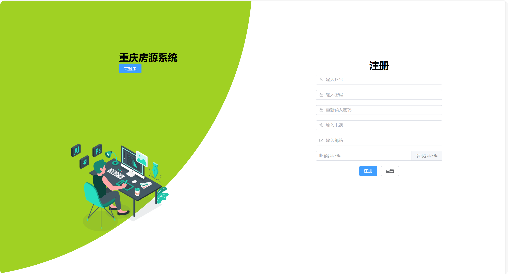
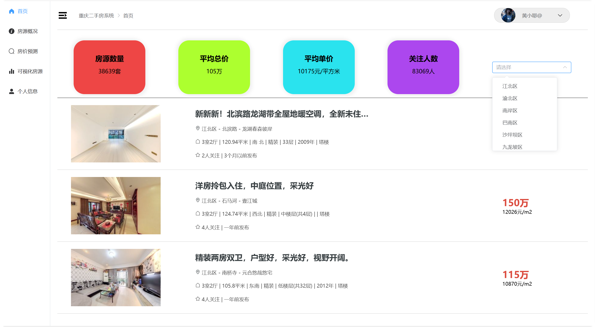
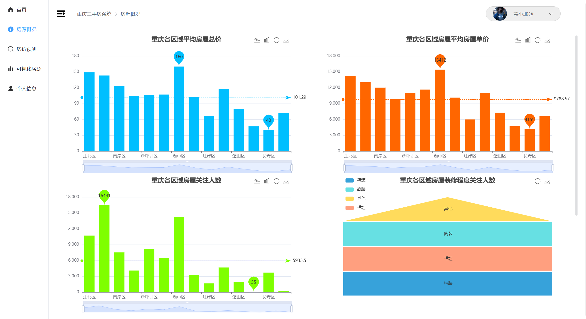
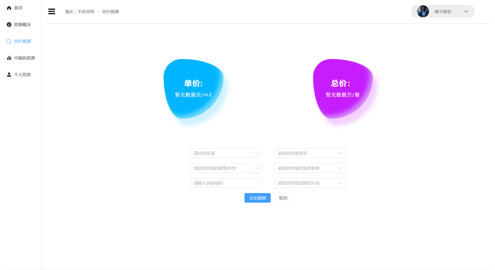
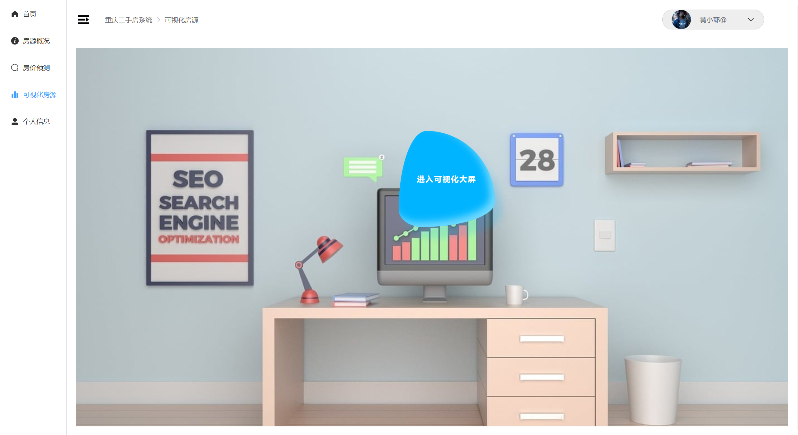
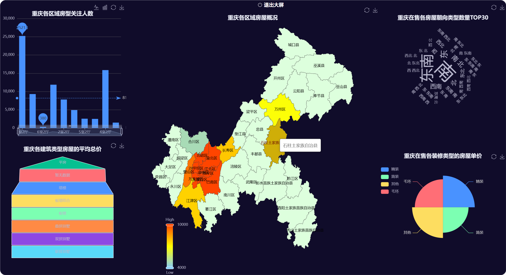
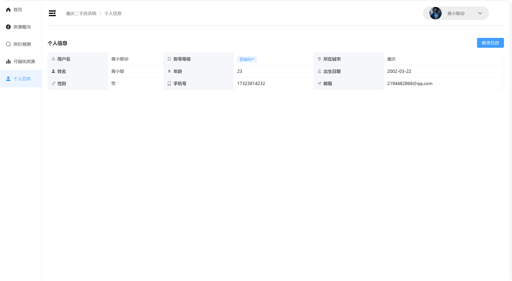

# 房源可视化系统(DRF+Vue3)

   ](https://img.shields.io/badge/Mysql-8.4-brightgreen)   


# 一、项目前言

该项目是基于DRF和Vue3实现的前后端分离的房源可视化系统,数据是爬取的链家的二手房源信息......

#### 1、项目源码地址

|        | 后端地址                                                     | 前端地址                                    |
| ------ | ------------------------------------------------------------ | ------------------------------------------- |
| github | https://github.com/huangxiaoye6/django-rest-framework-DRF--house- | https://github.com/huangxiaoye6/Vue3-house- |

#### 2、项目功能

- 用户注册：使用邮件验证码来实现用户注册
- 用户登录：使用Jwt实现用户信息传输和认证
- 房源查询：提供房源查询，可分区域进行查询
- 房源统计：统计房源的概况信息
- 房加预测：输入房源有关信息实现对房源的单价和总价进行预测
- 房源分析：分析房源的基础信息
- 可视化房源（大屏）：对房源进行大屏可视化
- 个人信息：实现对个人信息的查询和修改

#### 3、后端项目结构

```
HOUSE目录
│───manage.py  # 命令行管理文件
│───requirements.txt  # 项目的依赖文件
│   
├───app  # django的app目录
│   │───admin.py  # django的超级管理员文件
│   │───apps.py  # app的配置文件
│   │───models.py  # 数据库模型文件
│   │───serializers.py  # 序列化文件
│   │───tasks.py  # celery的执行任务文件
│   │───tests.py  # 单元测试文件
│   │───urls.py  # 子路由文件
│   │───views.py  # 业务视图函数文件
│   │   
│   ├───migrations  # 数据库迁移目录
│
├───house  # 项目的主目录
│   │───asgi.py  # 服务器配置文件
│   │───celery.py  # celery的配置文件
│   │───settings.py  # djago的配置文件
│   │───urls.py  # 主路由文件
│   │───wsgi.py  # 服务器配置文件
│         
├───media  # 媒体查询目录
│   └───avatar  # 用户头像上传目录
│
├───models  # 房价预测模型目录
│
├───utils  #工具目录
│   │───auth.py  # DRF用户认证文件
│   │───permission.py  # DRF权限文件
│   │───spyder.py  # 爬虫文件
│   │───throttle.py  # DRF限流文件


```

# 二、项目配置到本地

#### 1、项目依赖配置

在终端下执行requirements.txt

```
pip install -i https://pypi.tuna.tsinghua.edu.cn/simple -r requirements.txt 
```

#### 2、数据库配置

安装mysql和redis数据库，然后在mysql中创建数据库，如一下命令

```
create database house;
SET @@global.sql_mode= '';
```

然后在settings.py文件修改配置

```
DATABASES = {
    "default": {
        "ENGINE": "django.db.backends.mysql",
        "NAME": "house",
        "USER": "你的用户名",
        "PASSWORD": "你的密码",
        "HOST": "127.0.0.1",
        "PORT": "3306",
    }
}
```

运行django项目里的爬虫文件spyder.py

#### 3、项目配置

终端下执行

```
python manage.py makemigrations  # 生成数据库迁移文件
python manage.py migrate  # 执行数据库迁移文件
```

#### 4、项目运行

终端下执行

```
python manage.py runserver  # 项目启动
celery -A house worker -l info -P eventlet  # 必须再开一个终端进行celery的worker启动
```

在终端里看到[127.0.0.1:8000]()就说明后端配置成功了

# 三、项目效果演示

<center>
    
    
    
</center>


<center>
    
    
    
</center>

<center>
    
	
</center>


# 四、问题

如果项目有问题请在[这里](https://github.com/huangxiaoye6/django-rest-framework-DRF---house-/issues)点击提交，当然也可以发送到我的邮箱2194482868@qq.com,我将尽快为大家解答

# 致大家🙋‍♀️🙋‍♂️

如果本项目帮助到了你，请给项目加个[Star]()，让更多的人看到。 您的回复和支持将会是我继续更新维护下去的动力。


